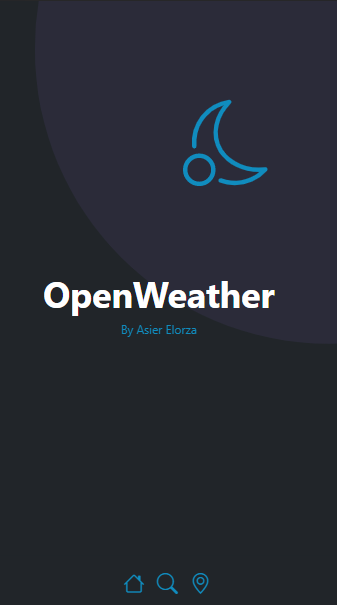

# OpenWeather-AsierElorza
## Descripción
Openweahter es una página web del tiempo estilo **Single Page Aplication (SPA)** en la que puedes buscar la temperatura y el estado del dia de hoy y los proximos 4 días de la ciudad que eligamos. Para ello esta app utiliza dos api llamadas:
- One Call Api **(https://openweathermap.org/api/one-call-api)** --> Con esta Api recogemos las coordenadas de la ciudad que introducimos.
- Current Weather data **(https://openweathermap.org/current)** --> Con las cordenadas de la anterior recogemos todos los datos necesarios de la ciudad que queremos.

## Tecnologias Utilizadas
Para la creación de esta página utilizamos variaas tecnologías:
- **Jquery**, para la implementación de la API y hacer la página funcional.
- **Sass**, creación del css utilizando variables y mixins.
- **Boostrap**, dale formato a la página web.

## Diseño
### Diseño home para pc

### Diseño home para mobile

